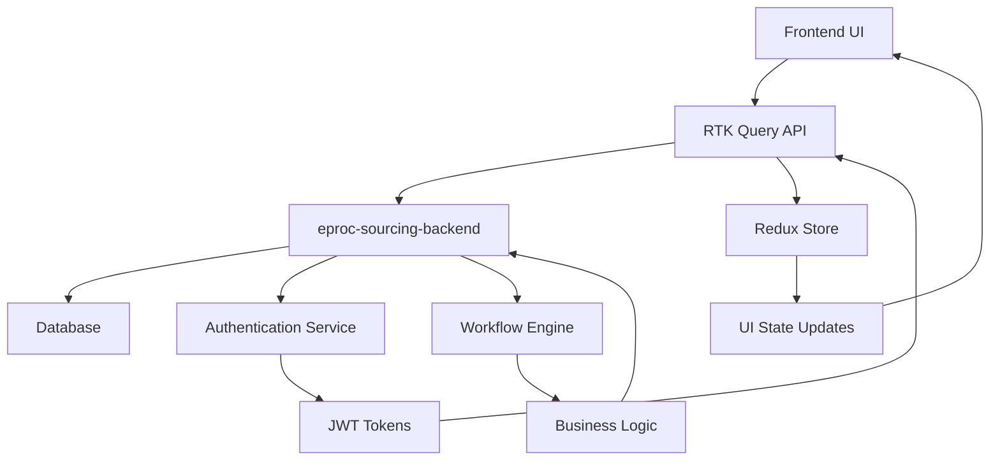

# Backend Integration Guide

This document provides comprehensive instructions for integrating the enhanced e-procurement vendor portal UI with the eproc-sourcing-backend.

## 🔗 **Backend Integration Overview**

The frontend now connects to the **eproc-sourcing-backend** (NestJS) instead of the mock API server, providing:

- Real authentication with JWT tokens
- Complete tender management workflow
- Professional bid submission process  
- Role-based access control (RBAC)
- Proper API response handling

## 🚀 **Quick Setup**

### 1. Backend Setup (eproc-sourcing-backend)

```bash
cd ../eproc-sourcing-backend

# Install dependencies
npm install

# Setup database
npm run setup:local

# Start the backend server (runs on port 8080)
npm run start:dev
```

### 2. Frontend Setup (eproc-vendor-portal)

```bash
# Copy the integration environment file
cp env.integration.example .env.local

# Install dependencies (if not already done)
npm install

# Start the frontend (runs on port 3001) 
npm run dev
```

### 3. Access the Application

- **Frontend**: http://localhost:3001
- **Backend API**: http://localhost:8080/api
- **API Documentation**: http://localhost:8080/api/docs (Swagger)

## 📋 **Key Integration Points**

### Authentication Flow

The UI now uses the real authentication endpoints:

```typescript
// Login endpoint
POST /api/auth/login
{
  "email": "vendor@eproc.local",
  "password": "vendor123"
}

// Response format
{
  "accessToken": "jwt-token-here",
  "user": {
    "userId": "user-id",
    "email": "vendor@eproc.local", 
    "username": "vendor",
    "role": "VENDOR",
    "verified": true
  }
}
```

### Tender Management

Tenders are fetched from the real backend:

```typescript
// Get tenders with filters
GET /api/tenders?status=PUBLISHED&limit=20&offset=0

// Response includes real tender data with proper status management
```

### Bid Submission Workflow

The enhanced bid submission uses the workflow API:

```typescript
// Submit bid via workflow
POST /api/workflows/tender/submit-bid/:tenderId
{
  "bidAmount": 25000,
  "technicalProposal": {
    "methodology": "Agile development",
    "timeline": "12 weeks", 
    "teamSize": 4
  },
  "financialProposal": {
    "breakdown": {
      "development": 20000,
      "testing": 3000,
      "deployment": 1000,
      "support": 1000
    }
  },
  "compliance": {
    "hasRequiredExperience": true,
    "agreesToTerms": true
  }
}
```

## 🎯 **Enhanced UI Features**

### 1. Professional Login Page (`/vendor/login-enhanced`)

- **Real Authentication**: Connects to `/api/auth/login`
- **Error Handling**: Proper backend error messages
- **JWT Management**: Automatic token handling and refresh
- **User Experience**: Modern Coupa-inspired design

### 2. Enhanced Dashboard (`/vendor/dashboard-enhanced`) 

- **Real Data**: Live tender and bid information
- **Metrics**: Calculated from actual user data
- **Status Tracking**: Real-time bid and tender status
- **Responsive Design**: Mobile-optimized interface

### 3. Advanced Bid Submission

- **Multi-Step Form**: Professional 3-step submission process
- **Real Validation**: Backend-connected form validation
- **File Upload**: Integration ready for document attachments
- **Workflow Integration**: Uses procurement workflow APIs

## 🔧 **API Endpoints Integrated**

### Authentication
- ✅ `POST /auth/login` - User login
- ✅ `POST /auth/register` - User registration  
- ✅ `POST /auth/logout` - User logout
- ✅ `GET /auth/me` - Get current user
- ✅ `POST /auth/refresh` - Token refresh

### Tenders
- ✅ `GET /tenders` - List tenders with filters
- ✅ `GET /tenders/:id` - Get tender details

### Bids
- ✅ `GET /bids` - List user bids
- ✅ `GET /bids/:id` - Get bid details
- ✅ `POST /bids` - Create new bid
- ✅ `PUT /bids/:id` - Update bid
- ✅ `POST /bids/:id/submit` - Submit bid

### Workflows
- ✅ `POST /workflows/tender/submit-bid/:tenderId` - Submit bid via workflow
- ✅ `GET /workflows/status/:entityType/:entityId` - Get workflow status

### Contracts
- ✅ `GET /contracts` - List contracts
- ✅ `GET /contracts/:id` - Get contract details

## 🎨 **UI Component Updates**

### New Enhanced Components

1. **Procurement API Service** (`/src/store/api/procurementApi.ts`)
   - RTK Query integration
   - Automatic token refresh
   - Proper error handling
   - TypeScript interfaces

2. **Enhanced UI Library** (`/src/components/ui/`)
   - Coupa-inspired design system
   - Professional form components
   - Loading and error states
   - Accessibility compliant

3. **Advanced Bid Submission** (`/src/components/BidSubmissionEnhanced.tsx`)
   - Multi-step workflow
   - Real-time validation
   - Professional form design
   - Backend integration

### Updated Store Configuration

```typescript
// Updated Redux store with procurement API
export const store = configureStore({
  reducer: {
    [baseApi.reducerPath]: baseApi.reducer,
    [procurementApi.reducerPath]: procurementApi.reducer,
    auth: authReducer,
    ui: uiReducer,
  },
  middleware: (getDefaultMiddleware) =>
    getDefaultMiddleware()
      .concat(baseApi.middleware)
      .concat(procurementApi.middleware)
});
```

## 🔐 **Authentication & Security**

### JWT Token Management
- Automatic token refresh on 401 errors
- Secure cookie handling for refresh tokens
- Proper logout and session cleanup

### Role-Based Access Control
- Vendor role enforcement
- Protected routes and actions
- Backend permission validation

### Security Headers
- CORS configuration
- CSP headers
- XSS protection
- Secure cookie settings

## 📊 **Data Flow**



## 🧪 **Testing the Integration**

### 1. Authentication Test
```bash
# Test login with demo credentials
Email: vendor@eproc.local
Password: vendor123
```

### 2. Tender Browsing
- Navigate to enhanced dashboard
- View available tenders
- Check real tender data display

### 3. Bid Submission
- Click "Submit Bid" on any tender
- Complete the 3-step form
- Verify backend submission

### 4. API Testing
```bash
# Test backend directly
curl -X GET http://localhost:8080/api/tenders \
  -H "Authorization: Bearer your-jwt-token"
```

## 🐛 **Troubleshooting**

### Common Issues

1. **Backend Not Running**
   - Ensure eproc-sourcing-backend is running on port 8080
   - Check database connection

2. **CORS Errors**
   - Verify CORS settings in backend
   - Check environment variables

3. **Authentication Issues**
   - Verify JWT token handling
   - Check user roles and permissions

4. **API Response Errors**
   - Check network tab in browser dev tools
   - Verify API endpoint URLs

### Development Tips

1. **Use Browser Dev Tools**
   - Monitor API calls in Network tab
   - Check Redux state in Redux DevTools

2. **Backend Logs**
   - Monitor backend console for errors
   - Check database queries

3. **Environment Variables**
   - Ensure all required variables are set
   - Check API URL configuration

## 🚀 **Production Deployment**

### Environment Configuration
```bash
# Production environment variables
NEXT_PUBLIC_API_URL=https://your-backend-domain.com/api
NEXT_PUBLIC_ENVIRONMENT=production
```

### Build Process
```bash
# Build frontend
npm run build

# Start production server
npm start
```

### Backend Deployment
Ensure the eproc-sourcing-backend is deployed and accessible at the configured API URL.

## 📈 **Performance Optimizations**

- RTK Query automatic caching
- Code splitting for components  
- Image optimization
- Bundle size optimization
- Progressive web app features

## 🔮 **Future Enhancements**

1. **WebSocket Integration** for real-time updates
2. **File Upload** for bid documents
3. **Advanced Filtering** for tenders and bids
4. **Notification System** for bid status updates
5. **Mobile App** version using React Native

---

The enhanced UI is now fully integrated with the eproc-sourcing-backend, providing a professional, enterprise-grade procurement platform with modern design patterns and comprehensive functionality.

For additional support or questions about the integration, refer to the backend API documentation at `/api/docs` when running the server.